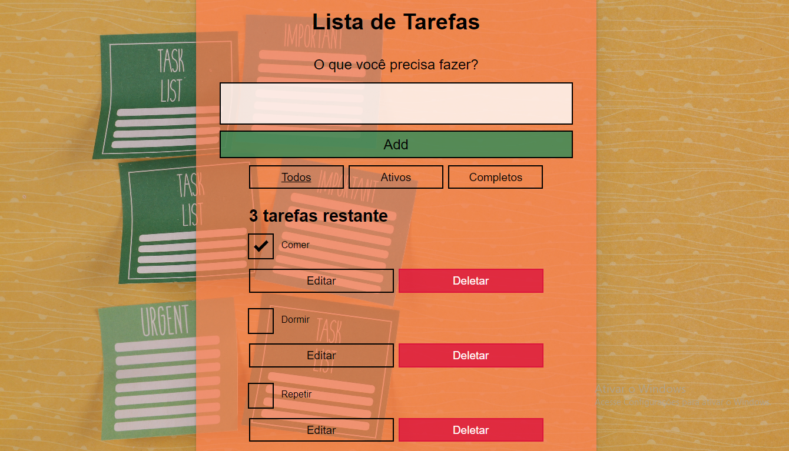

# App Lista de Tarefas criado c/ React

### Link: https://tarefas-lista-uhlx.vercel.app/

## ✨ Descrição

#### 
App de lista de tarefas em React criado baseado na documentação oficial do javascript com algumas alterações./>

## ✨ Tecnologias usadas

  
  
  
  

